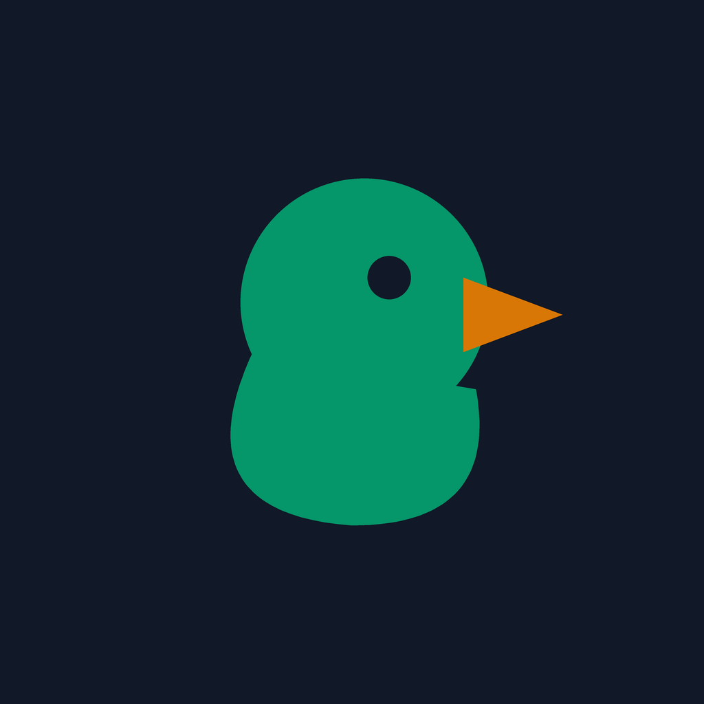
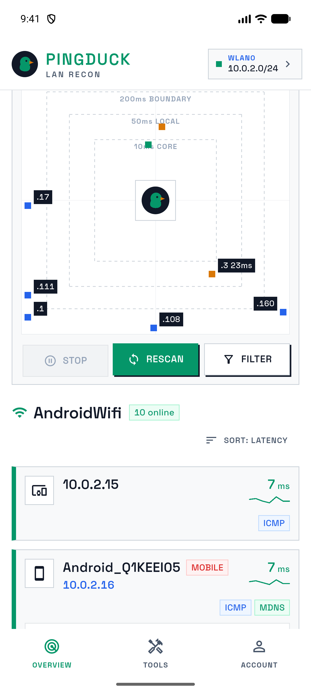
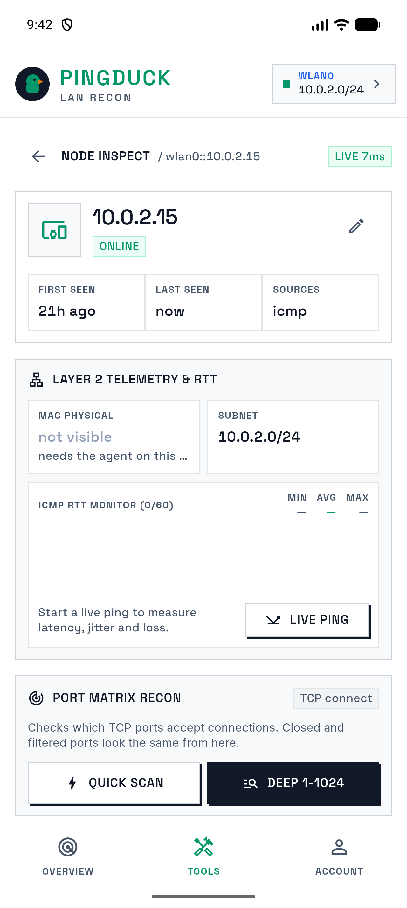
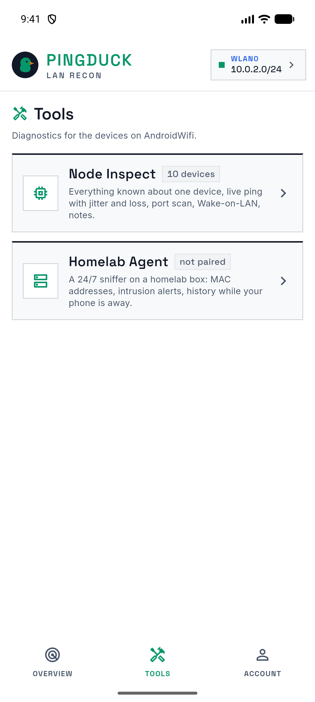
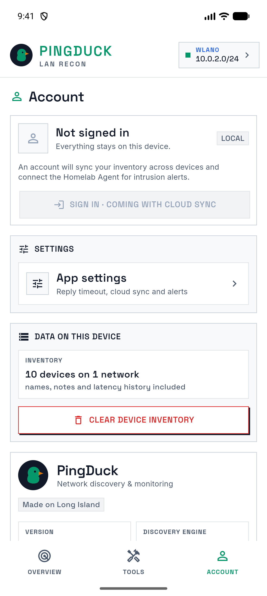

<div align="center">



# PINGDUCK

**LAN RECON** · the website

_Who's on your Wi-Fi?_

[](https://nextjs.org)
[](https://react.dev)
[](https://tailwindcss.com)
[](#build)
[](http://localhost:3014)

</div>

---

The marketing site for **PingDuck**, the LAN scanner for iOS and Android. It has a landing page, an FAQ, and the **Privacy Policy** and **Terms of Use** that App Store Connect and Google Play Console link to.

<div align="center">
<table>
  <tr>
    <td align="center"><br /><sub><b>RADAR</b></sub></td>
    <td align="center"><br /><sub><b>NODE INSPECT</b></sub></td>
    <td align="center"><br /><sub><b>TOOLS</b></sub></td>
    <td align="center"><br /><sub><b>LOCAL FIRST</b></sub></td>
  </tr>
</table>
</div>

## Quick start

```sh
npm install
npm run dev        # http://localhost:3014
```

<a id="build"></a>

```sh
npm run build      # every route prerenders as static
npm start          # production server on :3014
npm run lint
```

## Routes

| Route      | Page                                                     | Source                     |
| ---------- | -------------------------------------------------------- | -------------------------- |
| `/`        | Landing: hero, discovery methods, features, Homelab Agent | `src/app/page.tsx`         |
| `/faq`     | Permissions, missing devices, MACs, privacy               | `src/app/faq/page.tsx`     |
| `/privacy` | Privacy Policy (store listing URL)                        | `src/app/privacy/page.tsx` |
| `/terms`   | Terms of Use / EULA (store listing URL)                   | `src/app/terms/page.tsx`   |

## Configuration

Names, contacts and links used across the site live in **`src/lib/site.ts`**:

| Key                            | Used for                                                     |
| ------------------------------ | ------------------------------------------------------------ |
| `company`                      | Legal entity on the privacy page, terms, and footer          |
| `email`                        | Support and legal contact                                    |
| `url`                          | Canonical URL and Open Graph metadata                        |
| `jurisdiction`                 | Governing law in the terms                                   |
| `appStoreUrl` / `playStoreUrl` | Store badges; `null` shows **Coming soon to** instead of a link |
| `legalUpdated`, `year`         | "Last updated" date and copyright year                       |

> [!IMPORTANT]
> Dates are fixed strings, not `new Date()`. With `cacheComponents` on, reading the clock during render makes a route dynamic. Bump `legalUpdated` whenever the policy or terms change.

## Brand

The site follows the app's **Precision Editorial Recon** system (`pingduck_app/lib/core/theme/pingduck_colors.dart`): white canvas, carbon ink, hairline rules, with color used only for status. The tokens are defined in `src/app/globals.css`.

| Token     | Hex       | Role                                    |
| --------- | --------- | --------------------------------------- |
| `ink`     | `#111827` | Text, keylines, hard button shadows     |
| `ink-2`   | `#475569` | Secondary text                          |
| `hairline`| `#E2E5E8` | Rules and dividers                      |
| `live`    | `#059669` | Online, wordmark, primary accent        |
| `route`   | `#2563EB` | Links, mDNS/SSDP-only devices           |
| `pending` | `#D97706` | Marginal latency, "coming soon"         |
| `critical`| `#DC2626` | Errors, destructive actions             |

**Type:** Space Grotesk for display, labels and the wordmark (uppercase, wide tracking); Inter for body text. Both are self-hosted through `next/font`, so visitors' browsers make no requests to Google.

**Shape:** square corners, 1px borders, and the app's offset shadow (`.shadow-hard`). The hero's dashed boxes echo the app's latency rings (10 ms core, 50 ms local, 200 ms boundary).

## Screenshots

`public/screens/` holds 1280×2856 captures from the Android emulator. To refresh one, open the screen in the app and run:

```sh
adb -s emulator-5554 exec-out screencap -p > public/screens/overview.png
```

## Project layout

```text
src/
├── app/
│   ├── page.tsx           landing
│   ├── faq/ privacy/ terms/
│   ├── layout.tsx         fonts, header, footer, metadata
│   ├── globals.css        brand tokens, legal prose styles
│   └── icon.png           favicon (app icon)
├── components/
│   ├── site-header.tsx    logo + nav
│   ├── site-footer.tsx
│   ├── phone.tsx          screenshot device frame
│   ├── store-badges.tsx   App Store / Google Play (or "coming soon")
│   └── page-intro.tsx     title block for FAQ and legal pages
└── lib/site.ts            company, email, links, dates
```

## Before launch

- [ ] Confirm the legal entity (`company`). The app shows *Big Duck Networks*; the PRD lists Webcap Media Group.
- [ ] Replace the placeholder `email` and `url`.
- [ ] Have counsel review `/privacy` and `/terms`.
- [ ] Update the Privacy Policy **before** accounts, cloud sync, the Homelab Agent, or subscriptions ship. It currently describes a fully local app.
- [ ] Add store URLs once the listings are live.

---

<div align="center">
<sub>Made on Long Island · © 2026 Big Duck Networks</sub>
</div>
